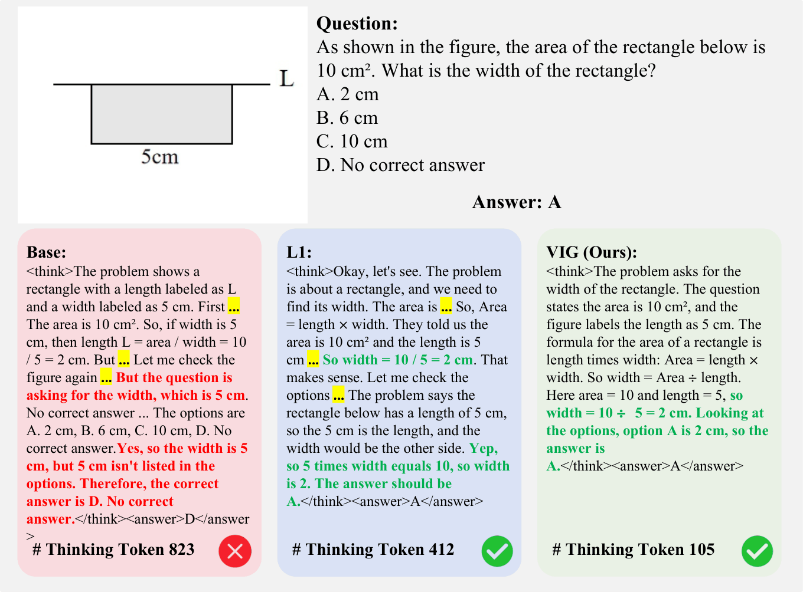
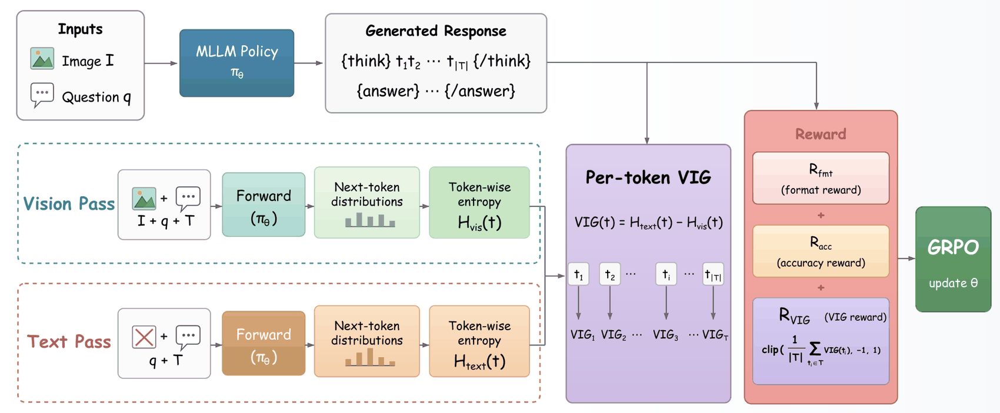
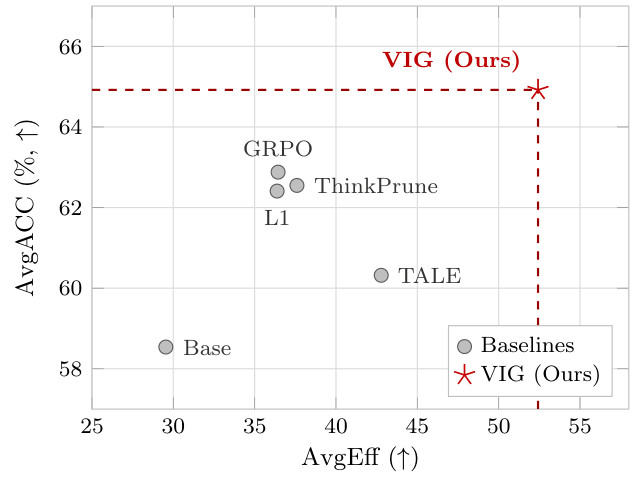

# VIG: Visual Information Gain as a Reward Signal for Multimodal Chain-of-Thought Compression

> **Accepted to the Findings of EMNLP 2026.**

VIG is an information-theoretic GRPO reward for compressing multimodal
chain-of-thought (CoT). It scores each reasoning token by **how much the image
reduces the model's predictive uncertainty about that token**, computed online
from two forward passes of the same policy: one with the image and one with the
visual tokens removed.

No reference chains, external annotators, step segmentation, or auxiliary reward
models are required. Chain shortening emerges as a *byproduct* of optimizing
visual information density rather than from an explicit length penalty.

<p align="center">
  
</p>

Length penalties trim the chain; only visually grounded reasoning removes the
redundancy at its source. On the same geometry question the base model spends
823 thinking tokens and talks itself out of the figure's plain label, L1 cuts
the chain to 412 tokens by penalizing length, and VIG answers in 105 tokens by
simply reading `5cm` off the figure.

## Method

<p align="center">
  
</p>

Two forward passes over the same generated chain, one with the image and one
with the visual tokens removed, give a token-level entropy difference that is
aggregated into a scalar reward and plugged directly into GRPO:

```
VIG(t) = H_txt(t) - H_vis(t)          # per-token visual information gain
R_VIG  = clip( mean_{t in <think>} VIG(t), -1, +1 )
R      = w_f * R_format + w_a * R_acc + w_v * R_VIG
```

`VIG(t)` coincides with the conditional mutual information
`I(t; I | q, ctx)`, so `R_VIG` is a length-normalized estimate of the total
visual information carried by the reasoning chain.

## Results

Qwen3-VL-8B-Thinking, six multimodal reasoning benchmarks
(`AvgEff = ACC / TLen x 1000`):

| Method | AvgACC | AvgTLen | AvgEff |
|---|---|---|---|
| Base | 58.54 | 2248.5 | 29.54 |
| GRPO | 62.88 | 1975.4 | 36.44 |
| L1 | 62.41 | 1951.8 | 36.38 |
| TALE | 60.32 | 1720.2 | 42.78 |
| ThinkPrune | 62.55 | 1921.4 | 37.60 |
| **VIG (ours)** | **64.92** | **1524.3** | **52.42** |

<p align="center">
  
</p>

VIG improves accuracy by **+2.37** and efficiency by **+39.4%** over the
strongest compression baseline, and shortens chains by 23% over plain GRPO
while *raising* accuracy by +2.04. The same pattern holds on 4B; see the paper
for the 2B block, where we narrow the accuracy claim because 53% of generations
truncate at the evaluation budget.

## Installation

```bash
git clone https://github.com/chaser682/vig.git && cd vig
pip install -r requirements.txt
```

The RL stack is version-sensitive. We ran all experiments with Python 3.12,
`torch 2.10`, `transformers 4.57`, `trl 1.4`, `vllm 0.18`, and DeepSpeed ZeRO-2
on a single 8xH20 node. Older `trl` releases changed the `GRPOTrainer` reward
signature; pin the versions in `requirements.txt` if you hit a mismatch.

## Training

```bash
# VIG on Qwen3-VL-8B-Thinking (main result, 500 steps)
accelerate launch --config_file configs/accelerate_zero2.yaml \
    train/train_grpo_vig.py --config configs/grpo_vig_token.yaml

# Baselines (plain GRPO / L1 / ThinkPrune)
accelerate launch --config_file configs/accelerate_zero2.yaml \
    train/train_grpo_baselines.py --config configs/grpo_pure.yaml
```

Configs are named `grpo_<method>[_<size>].yaml`; omitting the size suffix means
8B. The RL mixture contains 2,948 examples drawn from MMStar (val), MathVista
(testmini), and LogicVista (test), and is built automatically by
`data/dataset.py`.

Key reward knobs in the VIG configs:

| Key | Meaning |
|---|---|
| `w_vig` | weight `w_v` of the VIG term (1.0 in the paper) |
| `vig_score_mode` | `vig_only` reproduces the paper |
| `vig_step_split_mode` | `token` for the token-level mean used in the paper |
| `vig_comparison_mode` | `no_image` (paper) or `masked_image` (ablation) |
| `vision_span_mode` | how visual tokens are located, see below |

## Evaluation

```bash
python eval/eval_benchmarks.py \
    --model_path <checkpoint> \
    --datasets wemath mmmu mathvision dynamath papo_mmk12 geo3k \
    --output_dir output/eval_vig --judge_mode rule \
    --tensor_parallel_size 8 --max_tokens 4096 --max_model_len 16384
```

Scoring is rule-based by default (exact letter / numeric tolerance / LaTeX
normalization), which is what the paper reports and needs no API access.
`--judge_mode api` is optional and reads credentials from the environment; see
`eval/eval_api_judge.py`.

The reported protocol uses greedy decoding at a 4,096-token budget (2x the
2,048-token training length). `TLen` counts tokens before `</think>`.
`eval/eval_realworldqa.py` and `eval/eval_ocrbench.py` cover the non-math
benchmarks of the paper.

## Cross-architecture use

VIG only needs to locate the visual-token span in order to build the text-only
pass. `vig/compute_vig.py` parameterizes this, so other families plug in
without touching the reward:

| `vision_span_mode` | Span pattern |
|---|---|
| `qwen3vl` | `<\|vision_start\|> ... <\|vision_end\|>` |
| `internvl` | ` <IMG_CONTEXT>*N </img>` |
| `gemma3` | `<start_of_image> <image_soft_token>*N <end_of_image>` |
| `glm4v` | `<\|begin_of_image\|> <\|image\|>*N <\|end_of_image\|>` |
| `auto` | detect contiguous runs of `image_token_id` (no markers needed) |

All results in the paper are on the Qwen3-VL-Thinking family; we regard
cross-architecture generality as **unresolved** rather than established, and
release this abstraction to make external verification straightforward.

## Using VIG standalone

`examples/score_chain.py` scores one chain end to end:

```bash
python examples/score_chain.py --model Qwen/Qwen3-VL-8B-Thinking \
    --image figure.png --question "What is the length of AB in cm?"
```

`VIGCompressor` can also be called directly on any chain:

```python
from vig import VIGCompressor

compressor = VIGCompressor(model, tokenizer, processor=processor,
                           vision_span_mode="qwen3vl")
scores = compressor.compute_vig(cot_sentences, question, image)
for s in scores:
    print(f"{s.VIG:+.3f}  H_vis={s.H_vis:.3f}  H_txt={s.H_txt:.3f}  {s.step}")
```

Note that VIG measures **visual dependence**, which is neither visual
correctness nor counterfactual necessity: a confidently hallucinated reading can
score as high as genuinely grounded perception, and deleting low-VIG sentences
from an already-compressed chain hurts accuracy *more* than deleting high-VIG
ones. VIG is a training-time signal for shaping the output distribution, not a
post-hoc pruning criterion. See the Limitations section of the paper.

## Citation

```bibtex
  @misc{luo2026vigvisualinformationgain,
      title={VIG: Visual Information Gain as a Reward Signal for Multimodal Chain-of-Thought Compression}, 
      author={Wen Luo and Xiaohan Yi and Xiaotao Huang and Liqun Huang},
      year={2026},
      eprint={2608.21883},
      archivePrefix={arXiv},
      primaryClass={cs.CV},
      url={https://arxiv.org/abs/2608.21883}, 
}
```

<!-- ```bibtex
@inproceedings{luo2026vig,
  title     = {VIG: Visual Information Gain as a Reward Signal for Multimodal
               Chain-of-Thought Compression},
  author    = {Luo, Wen and Yi, Xiaohan and Huang, Xiaotao and Huang, Liqun},
  booktitle = {Findings of the Association for Computational Linguistics: EMNLP 2026},
  year      = {2026}
}
``` -->

## License

Code is released under the MIT License (see `LICENSE`). Evaluation benchmarks
and base models remain under their original licenses; our use is restricted to
non-commercial academic research, consistent with their stated intended use.
